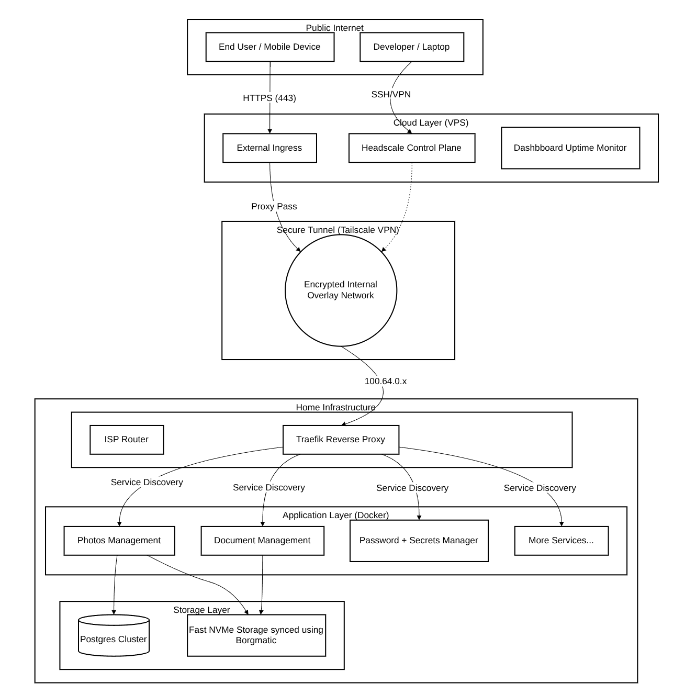
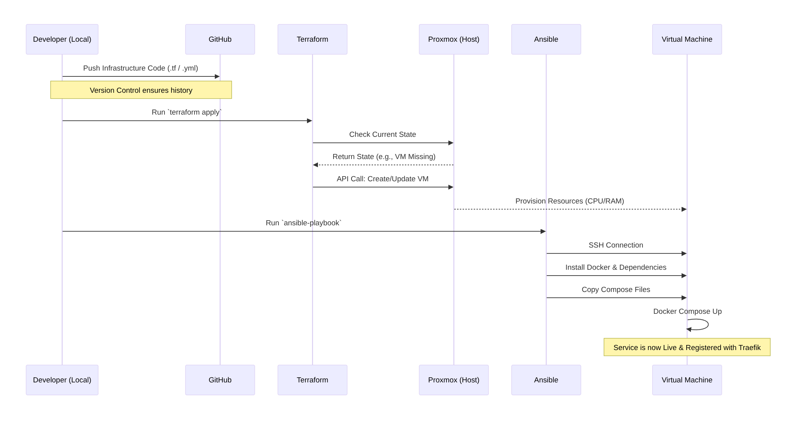

<div align="center">

# Infrastructure-as-Code

[](https://sabre.io/baikal/) [](https://github.com/mradigen/balti) [](https://min.io/) [](https://torsion.org/borgmatic/) [](https://github.com/mradigen/chota) [](https://github.com/dullage/flatnotes) [](https://syncthing.net/) [](https://headscale.net/) [](<[https://github.com/dani-garcia/vaultwarden](https://www.home-assistant.io/)>) [](https://immich.app/) [](https://github.com/mradigen/kachra) [](https://n8n.io/) [](https://docs.paperless-ngx.com/) [](https://traefik.io/) [](https://github.com/) [](https://github.com/dani-garcia/vaultwarden)

| **Hypervisor**                                                                                                      | **OS**                                                                                                           | **Tools**                                                                                                                                                                                                                                                                                                                                                                                                                                                                                                                                                                                                                                                                                                                                                                 | **Networking**                                                                                                        |
| ------------------------------------------------------------------------------------------------------------------- | ---------------------------------------------------------------------------------------------------------------- | ------------------------------------------------------------------------------------------------------------------------------------------------------------------------------------------------------------------------------------------------------------------------------------------------------------------------------------------------------------------------------------------------------------------------------------------------------------------------------------------------------------------------------------------------------------------------------------------------------------------------------------------------------------------------------------------------------------------------------------------------------------------------- | --------------------------------------------------------------------------------------------------------------------- |
| [](https://www.proxmox.com) | [](https://www.debian.org/) | [](https://www.ansible.com/) [](https://www.docker.com/) [](https://k3s.io/) <br> [](https://www.packer.io/) [](https://developer.hashicorp.com/terraform) [](https://developer.hashicorp.com/terraform) | [](https://www.tp-link.com/) |

</div>

<h2><b>Diagrams</b> </h2>






## **Overview**

This infrastructure follows a **Hybrid Layered Architecture**, decoupling stateful heavy workloads (hosted on-premise for cost efficiency) from critical stateless services (hosted on a cloud VPS for high availability). The system adheres to **Infrastructure as Code (IaC)** principles, using Terraform for modular resource provisioning and Ansible for configuration management to ensure the entire environment is reproducible and self-healing. Security is enforced through a **Zero-Trust Overlay Network** (Headscale/Tailscale), allowing secure, port-agnostic access to internal services without exposing them to the public internet.

This repository contains the IaC ([Infrastructure as Code](https://en.wikipedia.org/wiki/Infrastructure_as_code)) configuration for my homelab.

My homelab runs on **Proxmox** across three physical hosts, with VMs managed and maintained using [Terraform](https://www.terraform.io/). All VMs are provisioned from templates created with [Packer](https://www.packer.io/).

As of now, all services are **containerized** using **Docker Compose**. I plan to migrate them all to a **Kubernetes ([K3S](https://k3s.io/))** cluster for orchestration. The infrastructure is managed through **Ansible** playbooks for configuration management and automation.

All environment variables and secrets and stored in **HashiCorp's Vault**, and is hosted on an external server that is manually managed as of now. An **Ansible** playbook fetches the required environment variables and sets them in `.env` files for **Docker Compose**. Refer to `external/` for further details.

## 🛠 **Infrastructure Stack**

### **Tools & Automation**

- **[Terraform](https://www.terraform.io/)** - Infrastructure provisioning
- **[Packer](https://www.packer.io/)** - VM template creation
- **[Ansible](https://www.ansible.com/)** - Configuration management and automation
- **[Docker](https://www.docker.com/)** - Container orchestration
- **[Kubernetes (K3s)](https://k3s.io/)** - Container orchestration platform
- **[Vault](https://developer.hashicorp.com/vault)** - Environment variables and secrets management

### **Services**

| Purpose               | Service                                                                                   |
| --------------------- | ----------------------------------------------------------------------------------------- |
| Smart Home Monitoring | [HomeAssistant](https://www.home-assistant.io/)                                           |
| Backups               | [Borgmatic](https://torsion.org/borgmatic/)                                               |
| Tailscale VPN Server  | [Headscale](https://github.com/juanfont/headscale)                                        |
| Photo Management      | [Immich](https://github.com/immich-app/immich)                                            |
| Password Manager      | [Vaultwarden](https://github.com/dani-garcia/vaultwarden)                                 |
| Reverse Proxy         | [Traefik](https://traefik.io/)                                                            |
| Automation            | [n8n](https://n8n.io/)                                                                    |
| Note-taking           | [Flatnotes](https://github.com/gedulis12/flatnotes) + [Syncthing](https://syncthing.net/) |
| Document Storage      | [Paperless-ngx](https://paperless-ngx.readthedocs.io/)                                    |
| DAV Server            | [Baïkal](https://sabre.io/baikal/)                                                        |
| File Sharing          | [Balti](https://github.com/mradigen/balti)                                                |
| URL Shortener         | [Chota](https://github.com/mradigen/chota)                                                |
| Pastebin              | [Kachra](https://github.com/mradigen/kachra)                                              |

## **Repository Structure**

```
.
├── ansible/     # Ansible playbooks and configurations
├── docker/      # Docker Compose files and configurations
├── external/    # External service configurations that require uptime
├── packer/      # VM template definitions
└── terraform/   # Terraform infrastructure code
```

Each directory contains its own README with detailed information about the configurations and usage.

## **Hardware**

<details>
  <summary><strong>Setup</strong></summary>


</details>

<details>
  <summary><strong>Physical Hosts</strong></summary>

| Host      | CPU               | Threads | RAM   | Storage         |
| --------- | ----------------- | ------- | ----- | --------------- |
| **Vyria** | AMD Ryzen 5 5600X | 12      | 16 GB | 480 GB NVMe     |
| **Alpha** | Intel i5-6200U    | 4       | 8 GB  | 128 GB SATA SSD |
| **Beta**  | Intel i5-7300U    | 4       | 8 GB  | 256 GB SATA SSD |

</details>

<details>
  <summary><strong>Virtual Machines</strong></summary>

### Vyria

| VM              | Cores | RAM  | Storage | Purpose          |
| --------------- | ----- | ---- | ------- | ---------------- |
| **Vyria**       | 4     | 8 GB | 260 GB  | Main services    |
| **Kubernetes1** | 2     | 2 GB | 10 GB   | K3s cluster node |

### Beta

| VM                     | Cores | RAM  | Storage | Purpose          |
| ---------------------- | ----- | ---- | ------- | ---------------- |
| **Kubernetes2 (TODO)** | 2     | 2 GB | 10 GB   | K3s cluster node |
| **Home Assistant**     | 2     | 2 GB | 32 GB   | Home automation  |

### Alpha

| VM                     | Cores | RAM  | Storage | Purpose          |
| ---------------------- | ----- | ---- | ------- | ---------------- |
| **Kubernetes3 (TODO)** | 2     | 2 GB | 10 GB   | K3s cluster node |

</details>

<details>
  <summary><strong>Networking</strong></summary>

| Device                | Purpose          | Notes                                           |
| --------------------- | ---------------- | ----------------------------------------------- |
| **ISP Router**        | Internet gateway | Default configuration                           |
| **TP Link WR840N v6** | Network access   | Access Point mode, DHCP disabled, WiFi disabled |

</details>